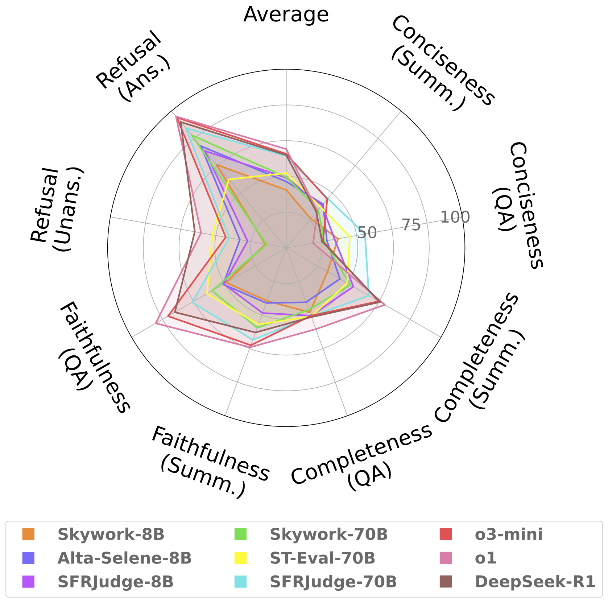

# Does Context Matter? ContextualJudgeBench for Evaluating LLM-based Judges in Contextual Settings
This is the codebase for [Does Context Matter? ContextualJudgeBench for Evaluating LLM-based Judges in Contextual Settings](TODO). 

[Huggingface Dataset](https://huggingface.co/datasets/Salesforce/ContextualJudgeBench)

Coming soon!
- Model outputs from all models we evaluated
- Script to reproduce main results from paper

ContextualJudgeBench is a pairwise benchmark with 2,000 samples for evaluating LLM-as-judge models in two contextual settings: Contextual QA and summarization. We propose a pairwise evaluation hierarchy and construct a split for each step in our evaluation hierarchy

<p align="center">
     <br>
  Split-level performance summary on <b>ContextualJudgeBench</b> for top-performing small and large judge models, as well as powerful reasoning models
</p>


## 🔍 About ContextualJudgeBench
The large language model (LLM)-as-judge paradigm has been used to meet the demand for a cheap, reliable, and fast evaluation of model outputs during AI system development and post-deployment monitoring. While judge models---LLMs finetuned to specialize in assessing and critiquing model outputs---have been touted as general purpose evaluators, they are typically evaluated only on **non-contextual scenarios**, such as instruction following. The omission of contextual settings---those where external information is used as **context** to generate an output---is surprising given the increasing prevalence of retrieval-augmented generation (RAG) and summarization use cases. Contextual assessment is uniquely challenging, as evaluation often depends on practitioner priorities, leading to conditional evaluation criteria (e.g., comparing responses based on factuality and then considering completeness if they are equally factual). To address the gap, we propose ContextualJudgeBench, a judge benchmark with 2,000 challenging response pairs across eight splits inspired by real-world contextual evaluation scenarios. We build our benchmark with a multi-pronged data construction pipeline that leverages both existing human annotations and model-based perturbations. Our comprehensive study across 11 judge models and 9 general purpose models, reveals that the contextual information and assessment criteria present a significant challenge to even state-of-the-art models. For example, OpenAI’s o1, the best-performing model, barely reaches 55\% consistent accuracy.

## 🚀 Quick Start 
### Setup
This code was tested with Python 3.10.16 and PyTorch 2.5.1. 

```
conda create --name cjb python=3.10.16
conda activate cjb
pip install torch==2.5.1
pip install -r requirements.txt
```

### Running evaluation
ContextualJudgeBench uses VLLM for inference, which is installed as a part of requirements.txt. First, serve your model with VLLM. An example script is provided in `scripts/serve_model.sh`
```
export HF_TOKEN=<YOUR_HF_TOKEN_HERE>

judge_model_name=<FULL_JUDGE_PATH_OR_HF_NAME>
CUDA_VISIBLE_DEVICES=0 vllm serve ${judge_model_name} \
    --tensor_parallel_size=1 \
    --max_model_len=16384 \
    --gpu_memory_utilization=0.8 \
    --port 8001 \
    --disable-log-stats \
    --disable-log-requests \
```

Next, run inference with `main_eval.py`. An example script is provided in `scripts/run_eval.sh`

```
python -u main_eval.py \
    --output_path [parent dir for results. Subfolders automatically created] \
    --splits [split to run evaluation on, or "all" for full benchmark] \
    --debug [only run 10 samples] \
    --num_threads [Num. parallel processing workers] \
    --api_key [Dummy for VLLM, include if you want to use together.ai] \
    --judge_model [model name, HF or local path. Same as used to serve the VLLM model.] \
    --prompt_strategy [Implements the 3 prompts we consider in our paper. For default workflow, use "vanilla"] \
    --base_url [VLLM inference server url] \
    --temperature [Sampling parameter temperature] \
    --top_p [Sampling parameter top_p] \
    --num_sequences [Sampling parameter n] \
```

(Optional) If your judge generates explanations, you can evaluate if they are using the right criteria to do evaluation, as described in Sec. 4.3 of our paper. To run critique evaluation, use `main_eval_critiques.py`. An example script is provided in `scripts/run_critique_eval.sh`. Note: This uses GPT-4o as a critique evaluator.
```
python main_eval_critiques.py \
    --eval_dir [/path/to/your/output/dir/${judge_model_short}/<used_prompt_strategy>] \
    --debug [only run 10 samples] \
    --num_threads [Num. parallel processing workers] \
    --judge_model [Model name, HF or local path. Same as used to serve the VLLM model. Used to load judgment parsing func.] \
    --evaluator [OpenAI model to use for eval. Defaults to GPT-4o]
    --temperature [Sampling parameter temperature for Evaluator (e.g., GPT-4o)]
```

### Ethical Considerations
This release is for research purposes only in support of an academic paper. Our datasets and code are not specifically designed or evaluated for all downstream purposes. We strongly recommend users evaluate and address potential concerns related to accuracy, safety, and fairness before model deployment. We encourage users to consider the common limitations of AI, comply with applicable laws, and leverage best practices when selecting use cases, particularly for high-risk scenarios where errors or misuse could significantly impact people’s lives, rights, or safety. For further guidance on use cases, refer to our [AUP](https://www.salesforce.com/content/dam/web/en_us/www/documents/legal/Agreements/policies/ExternalFacing_Services_Policy.pdf) and [AI AUP](https://www.salesforce.com/content/dam/web/en_us/www/documents/legal/Agreements/policies/ai-acceptable-use-policy.pdf). 

## Citation
If you find our project helpful, please consider citing our paper

```
Coming soon :) 
```
